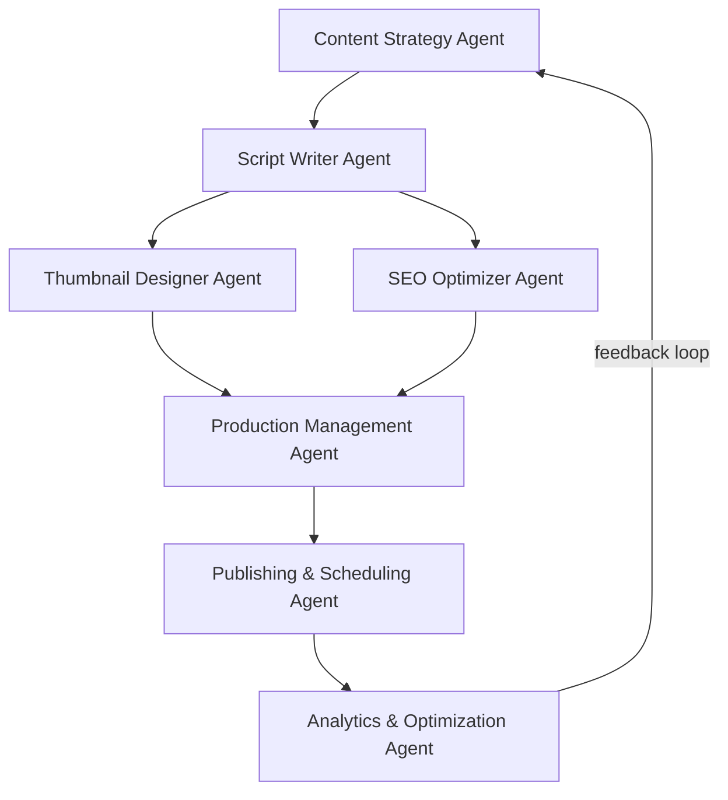
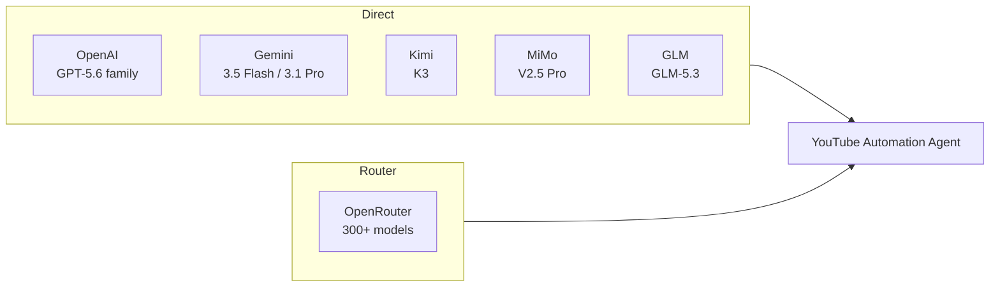
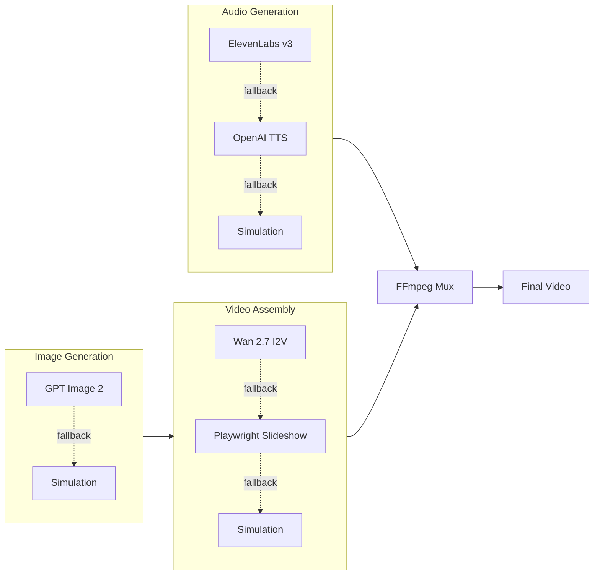

# YouTube Automation Agent

**The open-source AI agent that runs a YouTube channel end to end.**

Research topics → write scripts → generate narration and visuals → assemble videos → optimize metadata → review → schedule → publish → learn from analytics.

[](https://github.com/darkzOGx/youtube-automation-agent/actions/workflows/ci.yml)
[](LICENSE)
[](package.json)

- **Self-hosted:** your credentials, media, and channel data stay under your control.
- **Approval-first:** nothing is scheduled until quality, rights, and human-review gates pass by default.
- **Provider-flexible:** use Gemini, OpenAI, OpenRouter, Kimi, MiMo, GLM, or another OpenAI-compatible endpoint.
- **Observable:** follow persistent generation jobs, failures, review state, publishing, and local activation milestones from the dashboard.

<!-- Launch gate: add only a real 30–45 second dashboard demo captured from a verified end-to-end run. -->

## Quick start

```bash
git clone https://github.com/darkzOGx/youtube-automation-agent.git
cd youtube-automation-agent
npm install
npm run walkthrough
npm start
```

Open `http://localhost:3456`. The walkthrough explains each provider choice, tests credentials, and guides YouTube authorization.

Already know what you are doing? `npm run setup` offers a shorter classic flow, and `.env.example` documents every setting.

### What you need

- Node.js 18+
- A Google account and YouTube Data API credentials
- At least one AI text provider key
- FFmpeg, installed automatically through `ffmpeg-static`

Gemini offers free access for supported text and TTS usage. Gemini AI image generation currently requires paid-tier access; without an image provider, the agent can assemble gradient-based visuals instead.

## From idea to published video

| Stage | What the agent does | What you control |
| --- | --- | --- |
| Research | Finds topics and builds a content strategy | Niche, audience, blocked topics |
| Script | Writes the hook, narrative, CTA, and metadata | Voice, format, length, brand direction |
| Production | Generates narration and visuals, then assembles a real MP4 | Provider choice and media fallbacks |
| Review | Runs quality checks and opens the video in Review Studio | Facts, media rights, edits, approval |
| Publish | Schedules and uploads approved content | Privacy, timing, final decision |
| Learn | Pulls performance signals into the next strategy cycle | Automation and optimization settings |

The agent distinguishes real MP4 output from simulated placeholders. Simulated output cannot enter the approval or publishing path.

For release history, see [CHANGELOG.md](CHANGELOG.md).

## Architecture



## How It Works

Each agent handles one stage of the pipeline:

| Agent | Role |
|-------|------|
| **Content Strategy** | Analyzes YouTube trends, identifies topics, plans content calendar |
| **Script Writer** | Generates scripts with hooks, storytelling, CTAs |
| **Thumbnail Designer** | Creates thumbnails, runs A/B variations |
| **SEO Optimizer** | Keywords, titles, descriptions, tags |
| **Production** | Coordinates TTS audio, image assets, video assembly |
| **Publishing** | Uploads, schedules, manages playlists |
| **Analytics** | Tracks performance, feeds insights back to strategy |

## AI Providers

All OpenAI-compatible providers work out of the box — the system auto-configures the SDK base URL. Pick one, or use OpenRouter to access everything through a single key.



| Provider | Models | Base URL | Cost |
|----------|--------|----------|------|
| **OpenAI** | GPT-5.6 Sol, Terra, Luna | `api.openai.com/v1` | provider pricing |
| **OpenRouter** | 300+ models; curated defaults are validated against its live catalog | `openrouter.ai/api/v1` | varies by model |
| **Google Gemini** | Gemini 3.5 Flash, 3.1 Pro Preview, 2.5 Pro | via `@google/genai` SDK | free tiers vary by model and modality |
| **Kimi (Moonshot AI)** | Kimi K3, K2.7 Code, K2.6 | `api.moonshot.ai/v1` | provider pricing |
| **MiMo (Xiaomi)** | MiMo V2.5 Pro, V2.5 | `api.xiaomimimo.com/v1` | provider pricing |
| **GLM (Zhipu AI)** | GLM-5.3, 5.2, 5.1 | `api.z.ai/api/paas/v4/` | provider pricing |

Additional integrations: Anthropic Claude (`claude-opus-4-8`), ElevenLabs (Eleven v3 TTS), Replicate (Wan 2.7 video), local models via Ollama, any OpenAI-compatible endpoint.

## Configuration

### API Keys

#### YouTube Data API (required, free)

1. Create a project in [Google Cloud Console](https://console.cloud.google.com/)
2. Enable **YouTube Data API v3**
3. Create an OAuth 2.0 client (Desktop app)
4. Save the JSON as `config/credentials.json`

#### OpenAI

1. Get a key from [platform.openai.com](https://platform.openai.com/)
2. Set `OPENAI_API_KEY` in `.env`

#### OpenRouter (easiest — one key, all models)

1. Get a key from [openrouter.ai/keys](https://openrouter.ai/keys)
2. Set `OPENROUTER_API_KEY` in `.env`

#### Google Gemini

1. Get a key from [Google AI Studio](https://aistudio.google.com/)
2. Set `GEMINI_API_KEY` in `.env`

#### Kimi / MiMo / GLM

| Provider | Get key at | Env var |
|----------|-----------|---------|
| Kimi (Moonshot AI) | [platform.kimi.ai](https://platform.kimi.ai) | `MOONSHOT_API_KEY` |
| MiMo (Xiaomi) | [mimo.mi.com](https://mimo.mi.com) | `MIMO_API_KEY` |
| GLM (Zhipu AI) | [z.ai](https://z.ai) | `GLM_API_KEY` |

### Environment Variables

```env
# AI provider — pick one (or use OpenRouter for access to all)
OPENAI_API_KEY=sk-...
# OPENROUTER_API_KEY=sk-or-...
# GEMINI_API_KEY=...
# MOONSHOT_API_KEY=...
# MIMO_API_KEY=...
# GLM_API_KEY=...

# Optional: premium TTS
# ELEVENLABS_API_KEY=...
# ELEVENLABS_VOICE_ID=...

# Optional: AI video generation
# REPLICATE_API_KEY=...

# App config
NODE_ENV=production
PORT=3456
CHANNEL_NAME=Your Channel Name
TARGET_AUDIENCE=Your target audience
YOUTUBE_REGION=US
DEFAULT_PRIVACY_STATUS=private

# Optional: protect mutating API routes (POST /generate, /publish)
# API_KEY=some-long-random-string

# Optional anonymous activation milestones (off by default; HTTPS endpoint required)
# ANONYMOUS_TELEMETRY_ENABLED=false
# ANONYMOUS_TELEMETRY_ENDPOINT=https://your-collector.example/events
```

### Activation measurement and privacy

The dashboard calculates setup, first-real-MP4, approval, publication, and repeat-generation milestones locally from SQLite and files on disk. A video counts only when a non-simulated `.mp4` with an MP4 container signature still exists.

Anonymous milestone reporting is disabled by default and has no built-in collector. It activates only when you explicitly set both telemetry variables. The allowlisted payload contains the milestone name and time, agent version, OS family, Node major version, and a random installation ID. It never includes credentials, channel data, prompts, topics, titles, filenames, or video contents.

## Automation Schedule

```mermaid
gantt
    title Daily Pipeline
    dateFormat HH:mm
    axisFormat %H:%M

    section Content
    Generate content (strategy + script + thumbnail + SEO) :06:00, 2h

    section Publishing
    Process publishing queue :crit, 08:00, 14h

    section Analytics
    Collect analytics     :09:00, 1h
    Run optimizations     :22:00, 1h
```



The scheduler runs automatically after `npm start`. Content generation at 06:00, publishing queue processed every 15 minutes, analytics at 09:00, optimization at 22:00. Weekly strategy reviews run on Sundays.

## API

```bash
# health check
curl http://localhost:3456/health

# queue a video-generation job (send x-api-key if API_KEY is set in .env)
curl -X POST http://localhost:3456/generate \
  -H "Content-Type: application/json" \
  -H "x-api-key: $API_KEY" \
  -d '{"topic": "Top 10 Life Hacks", "style": "list"}'

# inspect the returned background job
curl http://localhost:3456/api/jobs/:jobId

# view schedule
curl http://localhost:3456/schedule

# get analytics
curl http://localhost:3456/analytics

# inspect, edit, and approve content before scheduling
curl http://localhost:3456/api/content/:contentId
curl -X POST http://localhost:3456/api/content/:contentId/approve \
  -H "Content-Type: application/json" \
  -H "x-api-key: $API_KEY" \
  -d '{"privacyStatus":"private","factChecked":true,"rightsConfirmed":true}'
```

## Production Pipeline



Each stage has graceful fallbacks. If a paid API key isn't configured, the system simulates that step so the rest of the pipeline still runs.

## Extending

### Custom AI provider

```javascript
// utils/ai-service.js
const Anthropic = require('@anthropic-ai/sdk');

class ClaudeAIService {
  constructor(apiKey) {
    this.client = new Anthropic({ apiKey });
  }
  async generateContent(prompt) {
    const message = await this.client.messages.create({
      model: 'claude-opus-4-8',
      max_tokens: 1024,
      messages: [{ role: 'user', content: prompt }]
    });
    return message.content[0].text;
  }
}
```

### Custom content types

```javascript
// agents/content-strategy-agent.js
const contentTypes = {
  'podcast': {
    duration: '10-15 minutes',
    style: 'conversational',
    thumbnail: 'podcast-style'
  },
};
```

## Project Structure

```
youtube-automation-agent/
├── agents/          # one file per agent
├── config/          # credentials, example configs
├── database/        # SQLite schema and access layer
├── data/            # generated content and assets
├── schedules/       # cron-based automation
├── utils/           # AI service wrappers, logging, credential management
├── .github/         # CI workflow (lint + tests on every push/PR)
└── index.js         # Express server + agent initialization
```

## Troubleshooting

| Problem | Fix |
|---------|-----|
| `Missing credentials for: an AI provider` | Configure any one provider with `npm run credentials:setup` — OpenAI is not required |
| `'ffmpeg' is not recognized` / no .mp4 produced | Run `npm install` (fetches the bundled binary), or install FFmpeg and set `FFMPEG_PATH` |
| Video marked `simulated`, nothing uploads | Check the ✗ lines in the startup capability check — a key or FFmpeg is missing |
| "Processing publish queue" but nothing publishes | The queue log now shows what's waiting; content publishes at its scheduled time (default: next day 2 PM) |
| YouTube API quota exceeded | Check quotas in Google Cloud Console; reduce posting frequency |
| Content generation failed | Verify API keys and credits; check `logs/` |
| Publishing failed | Re-authenticate YouTube OAuth tokens; check video format |

Enable debug logging:

```bash
NODE_ENV=development DEBUG_MODE=true npm start
```

## More Tools by darkzOGx

If this was useful, check out:

- [darkzloop](https://github.com/darkzOGx/darkzloop): terminal agent runner that turns any LLM into a disciplined software engineer (FSM control, model-agnostic, BYO auth)
- [darkzBOX](https://github.com/darkzOGx/darkzBOX): open-source Instantly.ai clone with smart automated email replies
- [open-sales-researcher](https://github.com/darkzOGx/open-sales-researcher): autonomous B2B company research. Works with Claude Code, Cursor, Copilot.
- [darkzseo](https://github.com/darkzOGx/darkzseo): SEO tooling

## Built by

[@darkzOGx](https://github.com/darkzOGx), a solo builder shipping AI automation and developer tools. Find me on [X](https://x.com/darkzOGx) and [laderalabs.io](https://laderalabs.io).

If this project saves you time, a star helps it reach more developers.

## Contributing

See [CONTRIBUTING.md](CONTRIBUTING.md) for ground rules (short version: one focused concern per PR, no lockfile churn, lint + tests must pass). For questions and setup help, use [Discussions](https://github.com/darkzOGx/youtube-automation-agent/discussions) — Issues is for bugs.

1. Fork the repo
2. Create a feature branch
3. Make changes and add tests
4. Submit a PR

```bash
git clone <your-fork>
cd youtube-automation-agent
npm install
npm run lint   # must pass — CI runs this on every PR
npm test
```

## License

MIT — see [LICENSE](LICENSE).

## Acknowledgments

- [OpenAI](https://openai.com/) — GPT-5.6 Sol, GPT Image 2, GPT-4o-mini-tts
- [OpenRouter](https://openrouter.ai/) — unified multi-model API
- [Google](https://ai.google.dev/) — Gemini 3.5 Flash, Gemini 3.1 Flash Image, Gemini 3.1 Flash TTS
- [Google Cloud](https://console.cloud.google.com/) — YouTube Data API
- [Moonshot AI](https://www.moonshot.ai/) — Kimi K3
- [Xiaomi](https://mimo.mi.com/) — MiMo V2.5 Pro
- [Zhipu AI](https://z.ai/) — GLM-5.3
- [ElevenLabs](https://elevenlabs.io/) — Eleven v3 TTS
- [Replicate](https://replicate.com/) — Wan 2.7 video generation
- [ConstructionBids.ai](https://constructionbids.ai) - AI scans every federal, state & local public works bid and matches you to contracts you'll win.

---

> This tool is for legitimate content creation. Comply with [YouTube's Terms of Service](https://www.youtube.com/t/terms) and Community Guidelines.
